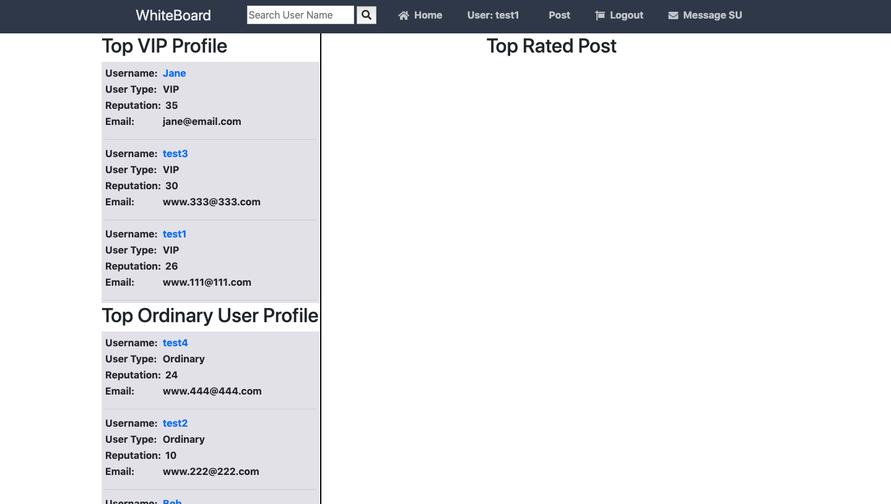
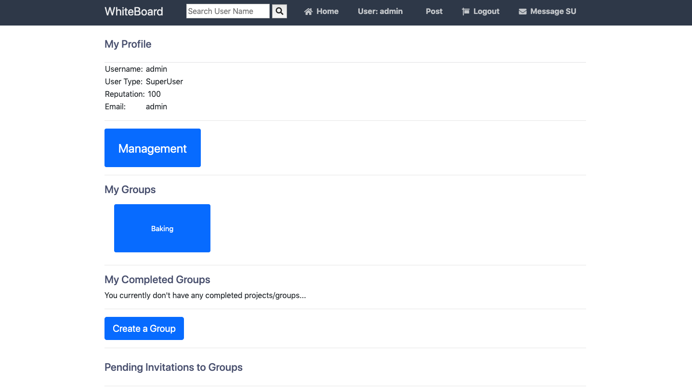
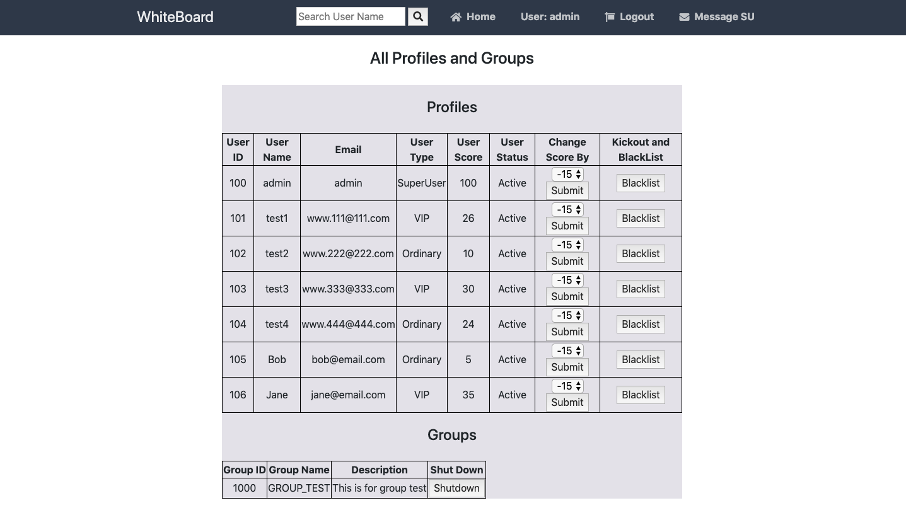

# WhiteBoard - csc322 (Software Engineering) Final Project 

Contributors: Linda Li, Masuda Farehia, Yifeng Jin <GROUP J>

	Uses Python Flask and MYSQL

Summary: 
 
This website will facilitate an active teaming of people with similar interest and skill-set to forge groups for a certain do-good project.For a random visitor, the system provides a home page showcasing the top 3 rated projects and top rating OU profiles and SU profiles to showcase the power of the system. A visitor can surf around to find more OUs/VIPs and projects. Visitors also have the option to register to be an OU: If approved, they can login will a password sent to their email. If rejected, the applicant has one chance to appeal and the SU will make a final decision to reverse the rejection. OUs can form groups by inviting other OU(s) for a certain purpose: Once a group is formed, a group web-page should be made available that is accessible to all group members All group members can moderate and post to the group page. This page will be used for posting updates and scheduling meet-ups. An OU whose reputation score is higher than 30 will be promoted to VIP; and a VIP whose score is lower than 25 will be demoted. 

For a more indepth look into our system and its features, please take a look the the spec memo, project specification, design documents, and diagrams included in this repository. 

#ScreenCaps 

# For easy to test, here's test-user info 

=============================================================================================================

1. Clone this repository 

2. Run command: set FLASK_APP=main.py

3. Run command: set FLASK_DEBUG=1

4. Run command: flask run

5. In your browser head to http://localhost:5000/

6. Or run from PyCharm and go to browser

In doing so, any changes you make will be reflected upon refreshing the browser, that way you don't have to constantly restart the web server

**Used python program to design an web application with python flask and MYSQL**

# Requirements

  - Download and install Python, We used Python 3.7.1, make sure to check the box Add Python to PATH on the installation setup screen.
  - Download and install MySQL Community Server and MySQL Workbench, you can skip this step if you already have a MySQL server set up.
  - Install Python Flask with the command: pip install flask
  - Install Flask-MySQLdb with the command: pip install flask-mysqldb
  - ALSO, All requirements package will be on the requirements.txt and here is the references to check python flask installation: https://flask.palletsprojects.com/en/1.1.x/installation/

# File Structure & Setup
**Each file will contain the following:**
* \\-- WhiteBoard
     &emsp; &emsp;|-- main.py
  * &emsp;\\-- static
      &emsp;&emsp; &emsp;|-- style.css
      &emsp;&emsp; &emsp;|-- base.css
  * &emsp; \\-- templates
      &emsp;&emsp; &emsp; |-- index.html
      &emsp;&emsp; &emsp; |-- register.html
      &emsp;&emsp; &emsp; |-- login.html
      &emsp;&emsp; &emsp; |-- profile.html
      &emsp;&emsp; &emsp; |-- layout.html 
      &emsp;&emsp; &emsp; |-- reply.html 
      &emsp;&emsp; &emsp; |-- admin.html
      &emsp;&emsp; &emsp; |-- group.html
      &emsp;&emsp; &emsp; |-- allUsers.html
      &emsp;&emsp; &emsp; |-- appeal.html
      &emsp;&emsp; &emsp; |-- close_group.html
      &emsp;&emsp; &emsp; |-- message.html
      &emsp;&emsp; &emsp; |-- reset_password.html
      &emsp;&emsp; &emsp; |-- adminMessages.html
      &emsp;&emsp; &emsp; |-- 404.html
      &emsp;&emsp; &emsp; |-- pending.html
 -
  - main.py — This will be our main project file, all our Python code will be in this file (Routes, MySQL connection, validation, etc).
  - index.html — home page created with HTML5 and CSS3.
  - register.html — Registration form created with HTML5 and CSS3.
  - login.html — Login form created with HTML5 and CSS3.
  - profile.html - profile page created with HTML5 and CSS3.
  - post.html - post page created with HTML5 and CSS3.
  - reply.html - reply page created with HTML5 and CSS3.
  - layout.html - The layout template for the home and profile templates.
  - admin.html - The SuperUser management page created with HTML5 and CSS3.
  - group.html - group page created with HTML5 and CSS3.
  - appeal.html - appeal page created with HTML5 and CSS3.
  - close-group.html - close group page created with HTML5 and CSS3
  - message.html - message page created with HTML5 and CSS3
  - reset_password.html - reset password page created with HTML5 and CSS3
  - adminMessages.html - admin messages page created with HTML5 and CSS3
  - pending.html - pending page created with HTML5 and CSS3
  - 404.html - 404 page created with HTML5 and CSS3

# The below instruction will start your web server (Windows):

- Make sure your MySQL server is up and running, it should have automatically started if you installed it via the installer.
- Make sure the database connection details below (in python) and your database should follow:
- app.secret_key = '111'
- app.config['MYSQL_HOST'] = 'localhost'
- app.config['MYSQL_USER'] = 'root'
- app.config['MYSQL_PASSWORD'] = '111111' (YOUR SQL SERVER PASSWORD!!!)
- app.config['MYSQL_DB'] = 'csc322_project'
- Open Command Prompt, make sure you have the project directory selected, you can do this with the command cd c:\your_project_folder_destination\python main.py on Windows.

# If you see the following information, you have successfully run the web application
* Serving Flask app "main" (lazy loading)
 * Environment: production
   WARNING: Do not use the development server in a production environment.
   Use a production WSGI server instead.
 * Debug mode: on
 * Restarting with stat
 * Debugger is active!
 * Running on http://127.0.0.1:5000/ (Press CTRL+C to quit)
# Click http://127.0.0.1:5000/ or copy it to your browser 
